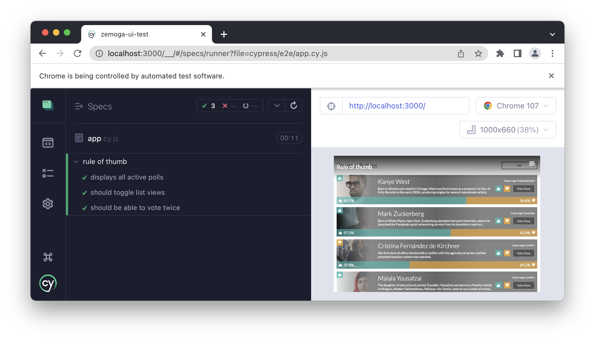

<center>
  
</center>

[](https://github.com/gantoreno/rule-of-thumb/actions/workflows/test.yml) 

# Rule Of Thumb™

Rule of Thumb™️ tracks the sentiment of their users on trending and controversial people from different fields, including politics, business, media and entertainment, etc. It's the best system out there for people to express their opinions on what currently goes on in the world.

> It's also [Zemoga](https://zemoga.com/)'s [front-end engineering test](https://github.com/zemoga/ui-test), but don't tell anyone. 🤫

## The Stack

Rule of Thumb™️ is a full-stack application built on top of [React](https://reactjs.org/) by using [Next.js](https://nextjs.org/), React's full-stack framework. Server-side rendering allows for great SEO optimizations as well as increased page performance, taking into account the development experience. Built entirely on [TypeScript](https://www.typescriptlang.org/).

For data persistence, it uses an AWS [RDS](https://aws.amazon.com/es/rds/) instance, running [PostgreSQL](https://www.postgresql.org/) as the database engine (it also uses an [S3](https://aws.amazon.com/es/s3/) bucket in order to store profile pictures), communicated with the application through the [Prisma](https://www.prisma.io/) ORM, which makes easy and fast accessing to database data while also maintaining the type-safety that the application needs, since Prisma and TypeScript make an awesome team.

For API interaction, this project uses the power of [tRPC](https://trpc.io/) in order to create public & performant procedures that are also type-safe and share type information across all environments with ease.

Last, but not least, this whole project is deployed and hosted in [Vercel](https://vercel.com/) fully automated through GitHub actions and preview deployments.

Here's a diagram containing the overall architecture of the system.


## Getting Started

Getting started with the project is fairly simple, configured as any other full-stack application.

### Prerequisites

Before getting started, make sure you have:

- Git
- Node.js
- Yarn
- PostgreSQL

### Getting Up and Running

First of all, clone the project (or fork it to your convenience), and `cd` into it:

```sh
$ git clone https://github.com/gantoreno/rule-of-thumb.git
$ cd rule-of-thumb
```

Install dependencies with [Yarn](https://yarnpkg.com/):

```
$ yarn install # or simply `yarn`
```

Before doing anything, make sure you have a PostgreSQL user and database created for the project, this is needed in order to ensure database connection. See PostgreSQL's [documentation](https://www.postgresql.org/docs/current/tutorial-createdb.html) for this matter.

Create the environment file by copying the built-in template:

```sh
$ cp .env.example .env
```

And place in `DATABASE_URL` your PostgreSQL connection string, which has the following shape:

```
postgresql://<user>:<password>@<host>:<port>/<database>?schema=public
```

After that, make sure to run the migrations by using the built-in `migrate` command from Prisma. Read more about Prisma migrations [here](https://www.prisma.io/docs/concepts/components/prisma-migrate) and `package.json` for reference.

```
$ yarn migrate
```

Finally, you can choose to seed the database with initial values by running:

```sh
$ yarn seed
```

This will run the seed located under `prisma/seeds/initialSeed.js`. You should have some people on your database after that.

You can now safely run the project by doing:

```sh
$ yarn dev
```

Happy hacking!

### Testing

This project contains both unit and end-to-end tests. Have a look below on how to run each of them.

#### Unit Tests

Unit tests are executed with [Jest](https://jestjs.io/) and [React Testing Library](https://testing-library.com/docs/react-testing-library/intro/), **only** the newly created unit components possess unit tests that focus on showcasing their individual behavior and data handling.

To run, use the `test` command:

```sh
$ yarn test
```

If you get an output like the following:


Hooray! Everything worked properly, as it is supposed to.

#### End-to-end Tests

E2E tests are achieved through [Cypress](https://www.cypress.io/), in order to run them, some more steps are required. Remember, E2E tests are expensive.

First, make sure you're running the app in development mode:

```sh
$ yarn dev
```

After that, open Cypress by running:

```sh
$ yarn e2e
```

A Cypress instance should launch and the automated browser should prompt you for your desired environment. Choose 'E2E tests' and then 'Google Chrome'. The Cypress automated window should open and search for `app.cy.js`.



All tests should pass smoothly, as shown on above's picture.

## Considerations

This is a basic project that achieves the minimal MVP functionality, it's definitely not mass-production ready, and further improvements could be applied in the future:

- Currently, there's no identity management. The application has no proper way to track individual users and their votes.
- This leads to potential security and biasing problems since it's a weakness that can be easily exploited.
  - Someone could maliciously create an automated tool to vote and re-vote based on their personal preferences, therefore leading to results that do not represent reality.
- Ideally, a re-voting limit should be applied to further prevent the same user voting more than once, or, at least rolling back their last vote and not persist it since it's not valid anymore.

Apart from that, this app has great potential to disrupt in the poll market and really become the number one service for the public opinion.
